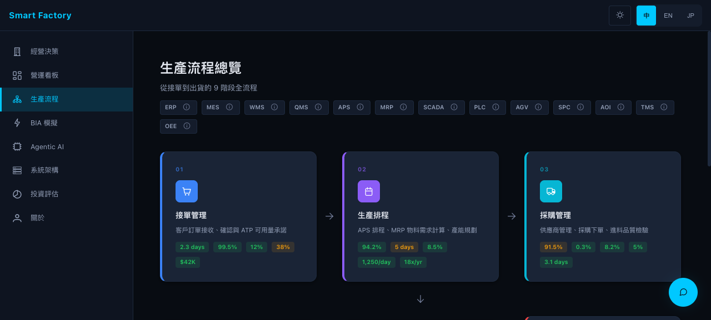
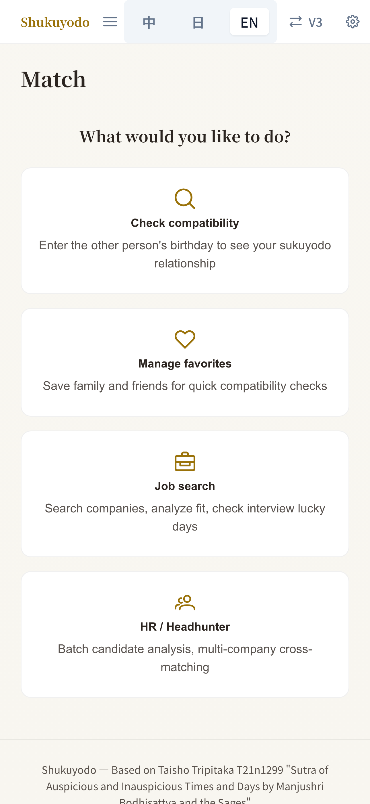

# SeiKai Kyo

**Shingon Buddhist priest who codes. 25 years on the factory floor.**

I sit with factory managers, figure out what breaks, and build systems that fix it. Over the past two and a half years, I independently delivered 30+ enterprise systems for a semiconductor materials manufacturer — MES, AI visual inspection (YOLO11), IoT automation, enterprise AI chatbot — all ISO 27001:2022 compliant.

Before that, I ran a software company for 19 years, delivering factory systems across 4 TSMC fabs and managing teams of up to 30 engineers.

---

## Smart Factory Demo

**25 years of factory knowledge, in one interactive system.**

> **[factory.dashai.dev](https://factory.dashai.dev)**




| | |
|---|---|
| **54** CRUD APIs | **9** Production Stages |
| **15** AI Tools | **3** Languages (ZH/EN/JA) |

**DashAI** — the panel on the bottom right of every page. It reads live factory data, flags non-conformance reports with three ranked options, and schedules orders to the right production line. It does not summarize. It operates.

**BCM Simulation** — pick a disaster scenario and watch cascading impacts spread across departments in real-time. Full RTO/RPO matrix.

**Agentic AI** — 5 factory agents in a collaboration network. Scenario theater replays multi-agent decision-making.

```
Vue 3 + PrimeVue + TypeScript    FastAPI + SQLModel + Neon PostgreSQL
Chart.js + vue-i18n              Claude AI (Tool Use, not RAG)
Vercel (frontend)                Render (backend)
```

---

## Shukuyodo

**A Shingon priest who codes, turning a 1200-year-old sutra into software.**

> **[shukuyo.dashai.dev](https://shukuyo.dashai.dev)**




Kukai brought the Shukuyodo sutra from the Tang Dynasty to Japan in 806 AD. It maps how two people relate using 27 lunar mansions — where friction shows up, how to work around it.

I translated the original scripture into a working system. Every result links back to the source text in the Taisho canon.

| | |
|---|---|
| **27** Lunar Mansions | **6** Relationship Types |
| **HR** & Headhunter Mode | **3** Languages (ZH/EN/JA) |

Rule-based engine. No LLM decides your result. Personal data stays in your browser. Free to use.

---

## What I Build

**Enterprise AI & Manufacturing**
- 30+ enterprise systems (MES, quality, IoT, AI vision) — solo delivery, ISO 27001:2022
- Enterprise AI chatbot with Claude API structured tool use
- YOLO11 visual inspection: AOI defect detection, process analysis
- Modbus TCP automation, AMR dispatching, RFID material tracking

**Language Learning**
- [ai-english-tutor](https://english.dashai.dev) — Voice-first English speaking practice with AI grammar correction
- [jlpt-n1-learner](https://github.com/seikaikyo/jlpt-n1-learner) — Adaptive JLPT study platform (N5-N1)
- [toeic-practice](https://github.com/seikaikyo/toeic-practice) — TOEIC Reading drill app

**Developer Tooling & Security**
- [ai-red-team](https://ai-red-team.dashai.dev) — LLM adversarial testing toolkit, 177 templates across 12 categories
- [dash-devtools](https://github.com/seikaikyo/dash-devtools) — Validation, E2E, AI vision CLI
- [dash-skills](https://github.com/seikaikyo/dash-skills) — Claude Code custom Skills
- [git-security-hooks](https://github.com/seikaikyo/git-security-hooks) — Pre-commit secret scanning

## Tech Stack

```
AI/LLM       Claude API (Tool Use), YOLO11, OpenCV
Enterprise   MES, Digital Transformation, Solution Architecture
Security     ISO 27001:2022, OWASP Top 10, RBAC, AI Red Teaming
Frontend     Vue 3, Angular 21, TypeScript, PrimeVue, PrimeNG
Backend      FastAPI + SQLModel, Python, Node.js
Database     PostgreSQL (Neon), Prisma ORM
IoT          Modbus TCP, OPC UA, RFID, WebSocket
Cloud        Vercel, Render, Neon, GitHub Actions
```

## Languages

Chinese (Native) / English (Professional) / Japanese (JLPT N2, BJT J3 — taking N1 in July 2026)

## Links

[Portfolio](https://portfolio.dashai.dev) / [LinkedIn](https://linkedin.com/in/seikaikyo)
