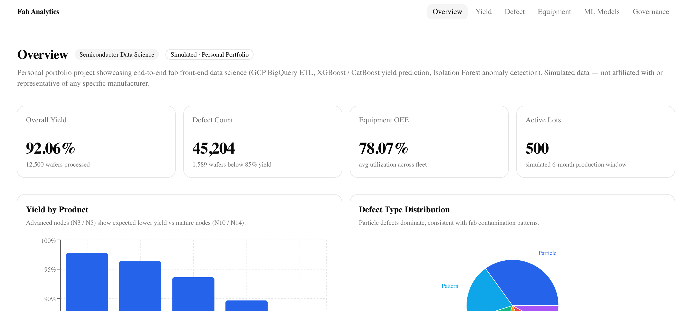

# SeiKai Kyo

**Manufacturing AI / Data Science Engineer. 25 years on the factory floor.**

I build the data science and AI that manufacturing runs on: yield prediction, anomaly detection, drift monitoring, and the smart-factory infrastructure underneath. Over the past two and a half years I independently delivered 30+ enterprise systems for a semiconductor materials manufacturer (MES, AI visual inspection with YOLO11, IoT automation, enterprise AI chatbot), all following ISO 27001:2022 principles.

Before that, I ran a software company for 19 years, delivering factory systems across 4 TSMC fabs and managing teams of up to 30 engineers. (Also an ordained Shingon Buddhist priest, a rare domain crossover.)

---

### Now

- Building **data science demos** end to end: [Fab Analytics](https://fab-analytics.seikai.dev) (BigQuery ETL, XGBoost / CatBoost yield prediction, Isolation Forest anomaly detection, PSI/KS drift, weekly retrain) and [AMC Analytics](https://amc-analytics.seikai.dev)
- Targeting **Manufacturing AI / Data Science / FDE** roles in Japan (Randstad / ExecutiveSearch.AI)
- Maintaining production demos (Shukuyodo: Nuxt 3 + Go) and **4 Go industrial repos** (SECS/GEM driver, edge gateway, OT security scanner, shared API gateway)

---

## Highlights

| | |
|---|---|
| **Data science across the line** | Yield prediction, anomaly detection, drift monitoring, MLOps (XGBoost / CatBoost / Isolation Forest / BigQuery) |
| **30+** enterprise systems delivered solo (MES, quality, IoT, AI vision) | Following ISO 27001:2022 |
| **4** TSMC fabs, **19** years running a software company | Up to 30 engineers managed |
| **Shingon priest** + semiconductor developer | Rare domain crossover |
| **11** production languages | ZH (Native) / EN (Professional) / JA (JLPT N2, BJT J3) |

---

## Flagship Projects

<table>
<tr>
<td width="50%" valign="top">

### [Fab Analytics](https://fab-analytics.seikai.dev)

End-to-end semiconductor data science, on simulated fab data.



| | |
|---|---|
| **XGBoost / CatBoost** yield prediction | **Isolation Forest** anomaly detection |
| **BigQuery** ETL + lineage | **MLOps**: PSI/KS drift, weekly retrain |

Wafer / lot / equipment / sensor / defect schema across nodes N3-N14. Yield prediction (R² 0.80 / 0.81 ensemble), anomaly detection (F1 0.98), feature importance, AutoML comparison, drift dashboard. All data simulated, not derived from any company.

```
Next.js 16 + FastAPI
BigQuery + Vertex AI + GCP
```

</td>
<td width="50%" valign="top">

### [Smart Factory Demo](https://factory.seikai.dev)

25 years of factory knowledge, in one interactive system.


| | |
|---|---|
| **54** CRUD APIs | **9** Production Stages |
| **15** AI Tools | **3** Languages |

Reads live factory data, flags NCRs with ranked options, and schedules orders. BCM simulation with cascading impacts and RTO/RPO matrix. 5 factory agents in a collaboration network.

```
Vue 3 + PrimeVue + TypeScript
FastAPI + SQLModel + Neon PostgreSQL
Claude AI (Tool Use) / Vercel + Render
```

</td>
</tr>
</table>

---

## Go Industrial Platform

**4 repos forming a complete industrial edge stack. All single Go binaries. Cross-compile to ARM64.**

<table>
<tr>
<td width="50%" valign="top">

### [go-factory-io](https://github.com/seikaikyo/go-factory-io)
SECS/GEM driver — 12 SEMI standards, 5 protocols, IEC 62443 SL4, single binary

</td>
<td width="50%" valign="top">

### [go-edge-gateway](https://github.com/seikaikyo/go-edge-gateway)
Device bridge + Modbus scanner — plugin architecture, scan-to-config, ARM64

</td>
</tr>
<tr>
<td width="50%" valign="top">

### [go-ot-security](https://github.com/seikaikyo/go-ot-security)
OT/ICS security scanner — CVE detection, IEC 62443 + NIST CSF 2.0 compliance

</td>
<td width="50%" valign="top">

### [dashai-go](https://github.com/seikaikyo/dashai-go)
Shared Go API gateway — Chi + pgx + JWT/Logto, embedded monitoring dashboard

</td>
</tr>
</table>

---

## What I Build

<table>
<tr><th>Category</th><th>Projects</th></tr>
<tr>
<td><b>Enterprise AI & Manufacturing</b></td>
<td>

[Smart Factory Demo](https://factory.seikai.dev) — 30+ enterprise systems, MES, quality, IoT, AI vision<br>
[GoTech Demo](https://gotech.seikai.dev) — Interactive enterprise architecture for 10K-1M users (Go + React + K8s)<br>
[Fab Analytics](https://fab-analytics.seikai.dev) — Semiconductor front-end data science on simulated data (BigQuery ETL, XGBoost/CatBoost, Isolation Forest)<br>
[AMC Analytics](https://amc-analytics.seikai.dev) — AMC filter analytics methodology (Thomas breakthrough + XGBoost, LSTM + CatBoost, full MLOps)<br>
[Factory Designer](https://designer.seikai.dev) — MES low-code workflow and form designer (drag-and-drop, client-only, JSON export)<br>
[secsgem-mcp-server](https://github.com/seikaikyo/secsgem-mcp-server) — Control semiconductor equipment via Claude Code<br>
[shopfloor](https://github.com/seikaikyo/shopfloor) (private) — Shop Floor Control prototype for nicegarden meat processing facility, tablet-first PWA, on-prem deployment target. Phase 1: carcass weight OCR (glm-ocr) + processing department timesheet + linear approval workflow + electronic scale PoC<br>
Enterprise AI chatbot (Claude API structured tool use) / YOLO11 visual inspection / Modbus TCP / AMR / RFID

</td>
</tr>
<tr>
<td><b>Language Learning</b></td>
<td>

[ai-english-tutor](https://english.seikai.dev) — Voice-first speaking practice with AI grammar correction<br>
[jlpt-n1-learner](https://github.com/seikaikyo/jlpt-n1-learner) — Adaptive JLPT study (N5-N1)<br>
[toeic-practice](https://github.com/seikaikyo/toeic-practice) — TOEIC Reading drill app

</td>
</tr>
<tr>
<td><b>Developer Tooling</b></td>
<td>

[dash-devtools](https://github.com/seikaikyo/dash-devtools) — Validation, E2E, AI vision CLI (on PyPI: pip install dash-devtools)<br>
[dash-skills](https://github.com/seikaikyo/dash-skills) — Claude Code custom Skills<br>
[claude-code-skills](https://github.com/seikaikyo/claude-code-skills) — 7 reusable skills pack<br>
[ai-red-team](https://ai-red-team.seikai.dev) — LLM adversarial testing, 177 templates across 12 categories<br>
[trace-demo](https://trace-demo.seikai.dev) — 7-layer distributed tracing with root cause attribution<br>
[gitguard_sync](https://github.com/seikaikyo/gitguard_sync) — GitLab/GitHub dual-platform repo security sync<br>
[DashAstro](https://github.com/seikaikyo/DashAstro) — Astronomy/astrology toolkit (Skyfield planetary calc + Claude)<br>
[git-security-hooks](https://github.com/seikaikyo/git-security-hooks) — Pre-commit secret scanning

</td>
</tr>
</table>

---

## Tech Stack

| Area | Technologies |
|------|-------------|
| **AI/LLM** | Claude API (Tool Use), YOLO11, OpenCV |
| **Enterprise** | MES, Digital Transformation, Solution Architecture |
| **SECS/GEM** | HSMS, OPC-UA, MQTT, Modbus TCP |
| **Security** | ISO 27001:2022, IEC 62443, OWASP Top 10, AI Red Teaming |
| **Frontend** | React 19, Next.js 16, Vue 3, Nuxt 3, Angular 21, TypeScript, shadcn/ui, PrimeVue, PrimeNG |
| **Backend** | Go (Chi + pgx), FastAPI + SQLModel, Node.js |
| **Database** | PostgreSQL (Neon), Prisma ORM |
| **IoT** | Modbus TCP, OPC UA, RFID, WebSocket, SECS/GEM, Electronic Scale (RS-232) |
| **OCR / PWA** | glm-ocr (handwritten pig ID), Tablet-first PWA |
| **Cloud** | Vercel, Render, Neon, GitHub Actions |

---

## Languages

Chinese (Native) / English (Professional) / Japanese (JLPT N2, BJT J3 — taking N1 in July 2026)

---

[Portfolio](https://portfolio.seikai.dev) / [LinkedIn](https://linkedin.com/in/seikaikyo)

*AI-assisted development with Claude Code.*
